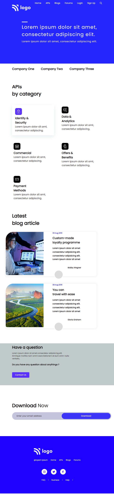

# Assignment - 09

## Project 09 [Live Link](https://full-stack-js-projects-09.netlify.app/)

- ### skills used in project
  - Learn media query, flexbox etc.
  - Learn to making background images responsive.
  - Total time taken 10hr to complete.
## Screenshot
### Desktop

### Mobile Responsive
